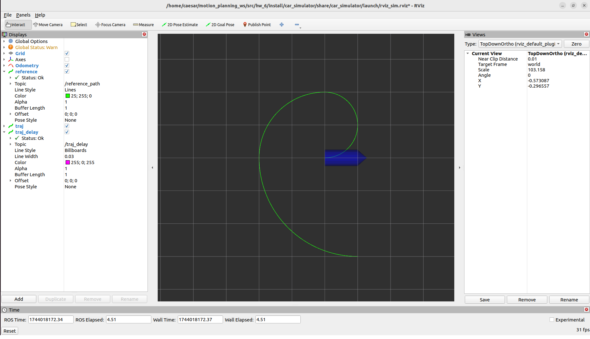
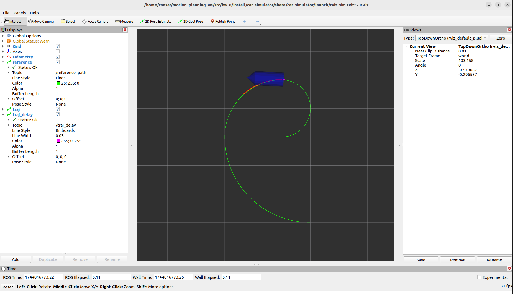

# 第六章 模型预测控制轨迹跟踪（MPC for Trajectory Tracking）

本章实现了一种基于模型预测控制 (MPC) 的轨迹跟踪算法，结合 OSQP 求解器，在 ROS 2 Humble 环境中实现了对车辆的预测跟踪控制。

本次作业在 `mpc_car.hpp` 文件中补全了核心控制逻辑，包括状态线性化、控制延迟补偿、约束构建与 MPC 预测路径等模块。最终效果可在 RViz 中实时可视化查看。

---

## 学习目标

- 理解离散化车辆模型的线性化方法  
- 掌握 MPC 预测控制框架与约束构建流程  
- 学会将优化问题形式化并调用 OSQP 求解器  
- 熟悉 ROS2 节点结构、话题发布与可视化方式  

---

## 文件结构说明

```
hw_6/
├── build/                    # 编译输出
├── install/                  # 安装目录
├── log/                      # 日志目录
├── src/
│   └── mpc_car/
│       ├── include/mpc_car/mpc_car.hpp   # ✅ 作业代码
│       ├── src/mpc_car.cpp
│       ├── launch/simulation.launch.py
│       └── ...
├── third_party/osqp/         # 外部优化库 OSQP
├── CMakeLists.txt
├── Initial.png               # 启动后初始状态
├── result.png                # 作业完成后的轨迹效果
└── README.md                 # 本文档
```

---

## 环境依赖

### 系统要求

| 项目 | 版本 / 说明 |
|------|-------------|
| 操作系统 | Ubuntu 22.04（推荐） |
| ROS 2 | [Humble Hawksbill](https://docs.ros.org/en/humble/) |
| 编译工具 | `cmake`（≥ 3.5）、`g++`、`make`、`colcon` |
| Python | 3.10+（ROS 2 Humble 自带） |

### ROS 2 依赖包

本项目仿真与 MPC 控制涉及以下 ROS 2 包，可通过 `apt` 安装：

```bash
sudo apt update
sudo apt install -y \
  ros-humble-rclcpp \
  ros-humble-rclcpp-components \
  ros-humble-nav-msgs \
  ros-humble-geometry-msgs \
  ros-humble-visualization-msgs \
  ros-humble-std-msgs \
  ros-humble-pcl-ros \
  ros-humble-pcl-conversions \
  ros-humble-rviz2 \
  ros-humble-rosidl-default-generators \
  ros-humble-rosidl-default-runtime \
  python3-colcon-common-extensions
```

若已安装完整 ROS 2 Desktop 版，上述大部分包通常已包含。

### Python 依赖

本项目 launch 文件（`simulation.launch.py` 等）由 Python 编写，需要 **Python 3.10+**。

#### 方式一：通过 apt 安装（推荐，与 ROS 2 配套）

```bash
sudo apt install -y \
  python3 \
  python3-pip \
  ros-humble-launch \
  ros-humble-launch-ros \
  ros-humble-ament-index-python
```

#### 方式二：通过 pip 安装

若使用 conda 等虚拟环境，或 apt 包不完整，可在已 `source /opt/ros/humble/setup.bash` 后执行：

```bash
cd ~/shenlan_class/Unity6/hw_6
pip install -r requirements.txt
```

`requirements.txt` 中主要包含：

| 包名 | 用途 |
|------|------|
| `ament_index_python` | 查找功能包路径（`get_package_share_directory`） |
| `launch` | ROS 2 启动框架 |
| `launch_ros` | ROS 2 节点启动（`launch_ros.actions.Node`） |

#### 使用 conda 环境时

若激活了 conda 环境（如 `A2_sim`），请确保仍能访问 ROS 2：

```bash
conda activate A2_sim          # 可选
source /opt/ros/humble/setup.bash
source install/setup.bash
```

若 `ros2 launch` 报错找不到 Python 模块，优先用 **方式一** 安装 apt 包，或在 conda 环境中执行 `pip install -r requirements.txt`。

### 系统库依赖

```bash
sudo apt install -y \
  libeigen3-dev \
  build-essential \
  git
```

### 第三方库

| 库 | 用途 | 说明 |
|----|------|------|
| [OSQP](https://osqp.org/) | QP 求解器 | 源码位于 `third_party/osqp/`，需本地编译安装（见下方编译说明） |
| Eigen3 | 矩阵运算 | MPC 状态空间与 QP 矩阵构建 |

### 工作空间内功能包

运行 `simulation.launch.py` 至少需要编译以下三个包：

| 包名 | 说明 |
|------|------|
| `car_msgs` | 车辆控制消息定义（`CarCmd`） |
| `car_simulator` | 自行车运动学仿真器 |
| `mpc_car` | MPC 轨迹跟踪控制器 |

`src/` 目录下其余包（如 `grid_path_searcher`、`trajectory_optimization` 等）为课程其他章节内容，**运行本章仿真不依赖它们**。

### 环境初始化

每次打开新终端，需加载 ROS 2 与工作空间：

```bash
source /opt/ros/humble/setup.bash
cd ~/shenlan_class/Unity6/hw_6
source install/setup.bash
```

---

## 编译说明

首先在 `third_party/osqp/` 目录下安装优化器：

```bash
cd third_party/osqp
mkdir build && cd build
cmake .. -G "Unix Makefiles" -DCMAKE_INSTALL_PREFIX=install
make -j$(nproc)
make install
```

然后返回项目根目录进行编译：

```bash
cd ~/shenlan_class/Unity6/hw_6
colcon build --packages-select mpc_car car_simulator car_msgs
source install/setup.bash
```

若仅修改了 `mpc_car.hpp`，可只编译对应包：

```bash
colcon build --packages-select mpc_car
source install/setup.bash
```

---

## 启动方式

每次运行前请先 source 工作空间：

```bash
cd ~/shenlan_class/Unity6/hw_6
source install/setup.bash
```

启动模拟器与 RViz 可视化：

```bash
ros2 launch mpc_car simulation.launch.py
```

启动成功后，终端应依次出现：

```
[car_simulator-1]: process started with pid [...]
[mpc_car-2]: process started with pid [...]
solve qp costs: ...ms
u: ... ...
```

RViz 中将显示：

- **绿色曲线**：参考轨迹（`reference_path`）
- **红色曲线**：MPC 预测轨迹（`traj`）
- **蓝色箭头**：小车当前位姿

初始界面如下图所示：

- **初始状态**：

  

---

## 注意事项

### 1. ROS 2 环境

确保已加载 ROS 2 Humble 环境（如使用 conda 虚拟环境，需先激活）：

```bash
source /opt/ros/humble/setup.bash
source install/setup.bash
```

### 2. 共享内存传输报错（RTPS_TRANSPORT_SHM Error）

若启动时出现如下报错，或节点长时间无法加载：

```
Failed init_port fastrtps_port7411: open_and_lock_file failed
```

可先清理残留进程与共享内存，再改用 UDP 传输启动：

```bash
pkill -f component_container
pkill -f rviz2
rm -f /dev/shm/fastrtps*

export FASTDDS_BUILTIN_TRANSPORTS=UDPv4
ros2 launch mpc_car simulation.launch.py
```

### 3. 节点启动需等待

`car_simulator` 与 `mpc_car` 启动后，请等待终端出现 `solve qp costs` 和 `u: ...` 输出后再观察 RViz，不要过早 Ctrl+C 中断。

### 4. 小车不动的排查

若 RViz 中能看到轨迹但小车不移动，可在终端检查：

- MPC 是否持续打印 `solve qp costs` 和 `u: ...`（控制量应为正常数值，不能是 `nan`）
- 是否频繁出现 `fail to solve QP!`

可用以下命令查看话题数据：

```bash
ros2 topic echo /car_cmd --once
ros2 topic echo /odom --once
```

### 5. 参数配置

MPC 与仿真参数位于：

- `src/mpc_car/config/mpc_car.yaml` — 参考轨迹、期望速度、预测步长 `N`、约束上限等
- `src/car_simulator/config/car_simulator.yaml` — 小车初始位姿、轴距、控制延迟等

修改参数后需重新编译并 source：

```bash
colcon build --packages-select mpc_car car_simulator
source install/setup.bash
```

---

## 编程任务说明

请完成下列文件中的核心函数：

```
src/mpc_car/include/mpc_car/mpc_car.hpp
```

任务要点包括：

- 在 `linearization(...)` 中补全状态转移矩阵 `Ad_`、输入矩阵 `Bd_`和偏移量 `gd_`
- 在 `compensateDelay(...)` 中实现控制延迟补偿逻辑
- 在 `solveQP(...)` 中补全 MPC 中的大矩阵 `BB`、`AA`、`gg` 和代价向量 `qx`
- 构建约束矩阵，并调用 OSQP 求解器

---

## 作业完成后效果

完成所有函数实现后，系统将自动跟踪轨迹，显示 MPC 预测轨迹与延迟补偿效果：

- **轨迹跟踪效果**：

  

---

## 👥 Authors and Maintainers

This README was written by the current maintainer based on the original project developed by the authors below.

<hr/>

<p align="right" style="line-height: 2.0; font-size: 14px;">
  <strong>Original Authors:</strong><br>
  Zhepei Wang &lt;wangzhepei@live.com&gt;<br>
  Ji &lt;jlji@zju.edu.cn&gt;<br>
  Fei Gao &lt;fgaoaa@zju.edu.cn&gt;<br>
  Kyle Yeh &lt;kyle_yeh@163.com&gt;<br>
  Yehong Kai &lt;yehongkai@todo.todo&gt;<br>


  <strong>Current Maintainer:</strong><br>
  Zhiye Zhao &lt;<a href="mailto:caesar1457@gmail.com">caesar1457@gmail.com</a>&gt; (2025–)
</p>

